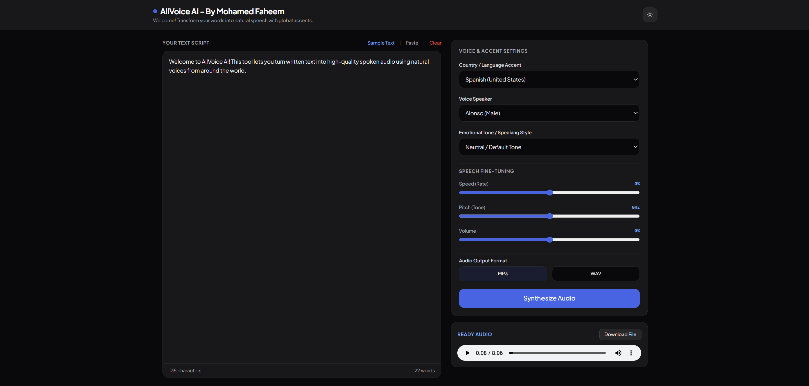

# AllVoice AI - Multi-Lingual Text-to-Speech Engine

AllVoice AI is a lightweight, responsive web application designed to synthesize natural-sounding audio from written text. Built with a **FastAPI** asynchronous backend and an **Edge TTS** integration, the tool features global accent selection, emotional voice styling, and granular voice controls.

---

## Key Features

* **Global Accents & Speakers**: Access natural neural voices across dozens of regions and languages worldwide.
* **Emotional Tone Selector**: Apply vocal expressiveness—such as *Cheerful*, *Empathetic*, *Excited*, *Newscast*, or *Casual Chat*—to compatible neural voices.
* **Granular Speech Fine-Tuning**: Real-time adjustment sliders for speech rate (speed), pitch (tone), and output volume.
* **Format Flexibility**: Instant audio processing with export options in both **MP3** and **WAV** formats.
* **Dark Mode & Responsive UI**: Clean interface built with Tailwind CSS, supporting automated light/dark themes and responsive layouts.

---

## How It Works

1. **Text Parsing**: The user enters a script into the text editor. Special characters are safely escaped for XML/SSML processing.
2. **SSML Generation**: If an emotional style or speech tuning parameter (rate, pitch, volume) is configured, the backend dynamically constructs a Speech Synthesis Markup Language payload.
3. **Async Edge TTS Synthesis**: The FastAPI server streams the request asynchronously through Microsoft Edge's neural voice service.
4. **Playback & Export**: The synthesized audio stream is rendered directly in the browser player, ready for playback or download.

---

## Screenshots



---

## Installation & Setup

Follow these steps to launch AllVoice AI locally on your machine.

### Prerequisites

* **Python 3.10+** installed on your system.
* **Git** for repository management.

### 1. Clone the Repository
```bash
git clone https://github.com/fahwem/AllVoice-AI.git
cd AllVoice-AI
```

### 2. Install Dependencies

Install all required Python packages using `pip`:
```bash
py -m pip install fastapi uvicorn edge-tts pycountry python-multipart
```
### 3. Run the Server

Launch the ASGI server using Uvicorn:
```bash
py -m uvicorn main:app --reload
```
### 4. Open in Browser

Once the terminal displays `Application startup complete`, open your browser and navigate to:

http://127.0.0.1:8000

---

## Project Structure

├── main.py          # FastAPI server handling voice synthesis and SSML conversion
├── index.html       # Frontend interface built with Tailwind CSS & JavaScript
├── README.md        # Project documentation
└── .gitignore       # Git ignore rules for cached/temporary files
